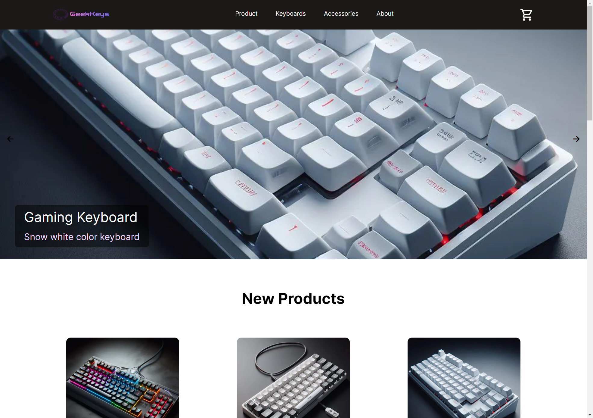

# GeekKeys

A ecommerce website to sell keyboards and accessories. Built in NextJS using Typescript

Deployed link: https://geekkeys.choheitoby.com/

## Features

- Using hooks to store items in busket
- Mobile responsive design

## Tech Stack

**Client:** NextJS, TailwindCSS, Material UI

### Preview:




## Installation:

```
git clone https://github.com/Cho-Hei/keyboard-web
cd keyboard-web
npm install
npm run build
npm run start
```
